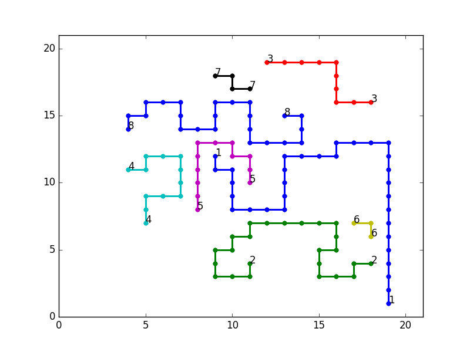

# Cell Router
A cell router that uses SAT


## About

This program does two things:
1) It creates and stores the resulting CNF formula
2) It solves via some SatSolver (by default, picosat) the generated formula
   and stores the resulting placement. It can also, optionally, plot it
   for the two dimensional case.


## Dependencies:

Python 3.x. Athough it is likely that Py2.7 works too

Some sat solver that accepts formulas in DIMACS CNF format. I have implemented support for picosat output parsing. If you want to use another SAT solver, then implement in a {sat_solver_name}_parser.py file a `parse_output` function that parses its corresponding output.
This function must return None if formula was UNSAT, and a list with a leading zero followed by the values of the variables if it was SAT.
You can take picosat_parser.py as an example.
The satsolver should be in your PATH. That is, you should be able to call it by typing "satsolvername" from any directory.

Matplotlib. Only if you use the --draw option.

## Format for input cases:

```
numnets numdim dim1 ... dimn
source1coord1 ... source1coordnumdim sink1coord1 ... sink1coordnumdim
...
sourcencoord1 ... sourcencoordnumdim sinkncoord1 ... sinkncoordnumdim
```

All coordinates must be integers, as they will serve to indicate the position of net endpoints in a discretized grid.

## Sample run
`python3 src/main.py data/example --draw`

This should leave a `output.png` file with a content that is very
similar to the sample image above.


